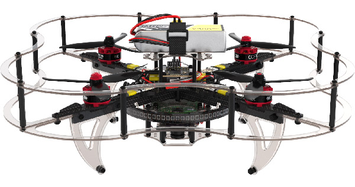
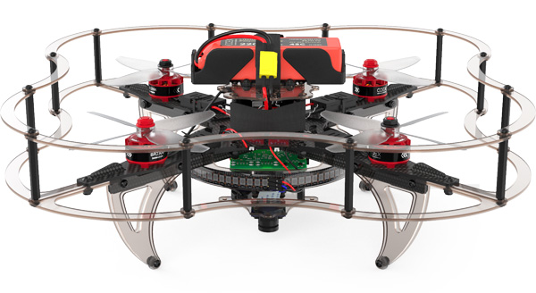
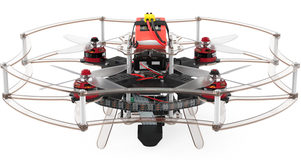
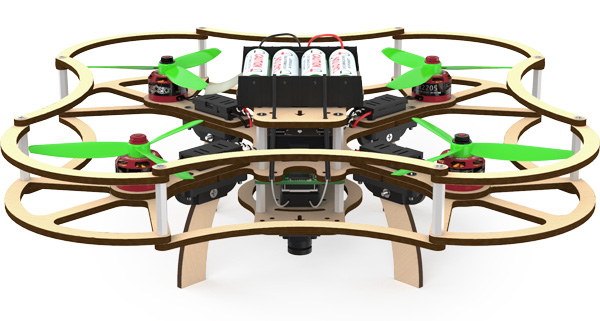

# Drone drone assembly

This section contains articles describing the assembly of each version of Drone.

<table class=versions>
     <tr><th>Version</th><th>Image</th></tr>
     <tr>
          <td>
               <a href="assemble_4_2.md">Drone&nbsp;4.2</a>
               
(<a href="assemble_4_2_ws.md">4.2&nbsp;WorldSkills</a>)

          </td>
          <td></td>
     </tr>
     <tr>
          <td><a href="assemble_4.md">Drone&nbsp;4</a></td>
          <td></td>
     </tr>
     <tr>
          <td><a href="assemble_3.md">Drone&nbsp;3</a></td>
          <td></td>
     </tr>
     <tr>
          <td><a href="assemble_2.md">Drone&nbsp;2</a></td>
          <td></td>
     </tr>
</table>

Links to Drone's parts CAD-models are available in the "[CAD-models](models.md)" article.

## Determination of version

Use serial number to determine the version of your Drone.

In this case the number *420* indicates the Drone version **4.2**.
