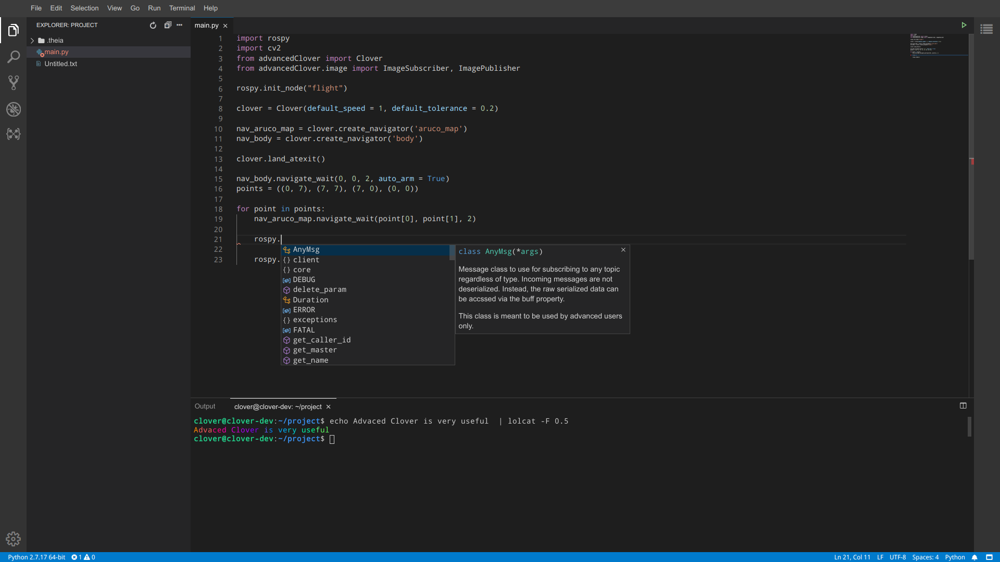
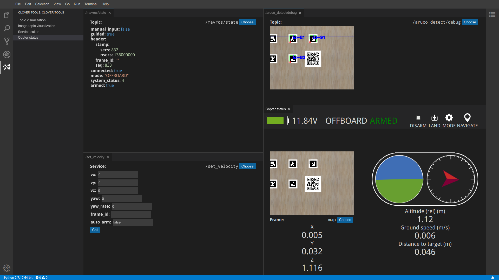
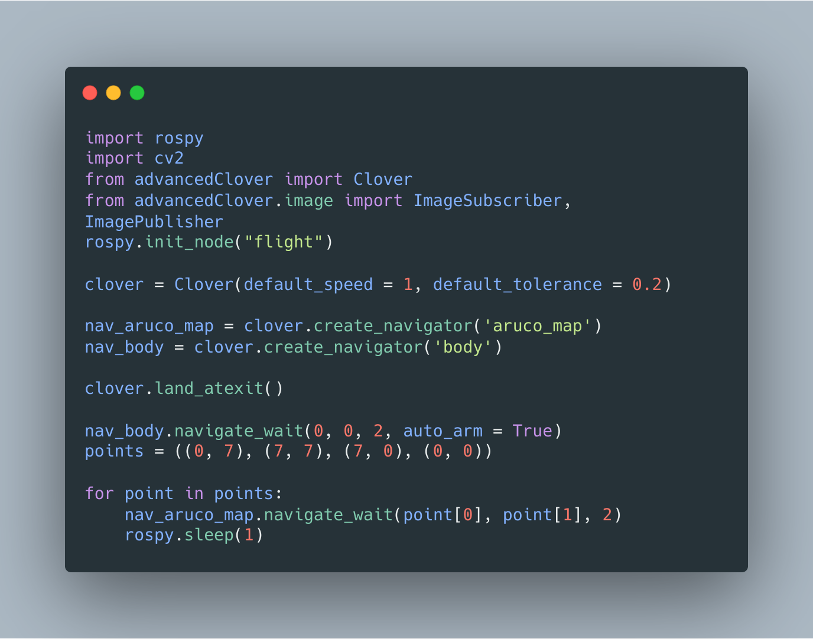

# Advanced Drone

[CopterHack-2021](copterhack2021.md), team **FTL**. Контакты: @maximmasterr в Telegram.

Как-то раз устав выполнять некоторые действия с Клевером мы решили их упростить, и так появился проект advancedDrone, которой включает в себя следующие элементы:

* IDE
  * VSCode-like IDE в браузере
  * Интегрированный файловый менеджер
  * Интегрированный терминал
  * Автокомплит
  * Возможность просмотра топиков
  * Возможность просмотра топиков с изображениями
  * Возможность вызова сервисов
  * Возможность просмотра статуса коптера
* Библиотека для Python
  * Упрощение работы с навигацией
  * Упрощение работы с камерой

Пример автокомплита, терминала и файлового менеджера:

Пример инструментов ROS и Copter Status:

Пример полёта по квадрату с использованием advancedDrone:

Более подробно об установке и использовании advancedDrone можно почитать [здесь](https://ftl-team.github.io/droneIDE).

## Технические подробности

Итак, что у нас внутри:

* [Theia](https://theia-ide.org/) прикольная web IDE которая очень похожа на VSCode и во многом даже лучше его.
* Расширения для vscode (работает и в theia), предоставляющее инструменты ROS.
* Питоновская библиотек, на самом деле это просто примеры из документации вынесенные в классы.
* Документация на docsify (gitbook слишком усложнён).
* Сборка на GitHub actions.

На самом деле интерес представляет только расширение, но я расскажу о всех частях.

### IDE

Изначально мы использовали code-server, но он слишком долго собирался и был монолитен, поэтому мы перешли на theia которая менее монолитна и собирается намного быстрее, однако её пришлось допилить:

1. Theia по дефолту тянет с собой около 1гб `node_modules` что не очень хорошо, так что мы добавили сборку в один бинарник с помощью pkg, однако необходимо патчик код генерируемый при build перед упаковкой в бинарник с помощью [патча](https://raw.githubusercontent.com/FTL-team/droneIDE/master/ide/src.patch).
2. Несмотря на то что по сравнению с code-server сборка занимала раза в три меньше времени, её пришлось ещё немного распараллелить вынеся скачивание плагинов/расширений в отдельный job на GitHub actions.
3. Благодаря стараниям тех людей кто пишет web-стандарты theia нормально работает либо на HTTPS, либо на localhost, по этому мы написали специальную программку на golang которая на лету генерирует сертификат, подписывает его корневым (который установил пользователь), и им по нему отправляет HTTPS.

### Расширение

Вот здесь самое интересное, расширение написано на TypeScript, собирается с помощью webpack и использует react, roslibjs и OpenCV.

#### ROSLIB.js

Для коммуникации с ROS используется библиотека roslib.js, у неё есть некоторые особенности:

1. Так как мы используем строго (ну почти) типизированный TypeScript нам нужен типизированный ROS, типизация по дефолту лежит в DefinitelyTyped, но она там немного кривая, поэтому лучше создать [файл](https://github.com/FTL-team/droneIDE/blob/master/droneExtension/src/ros/roslib.d.ts) roslib.d.ts который будет содержать типизацию для roslibjs и в случае если она не совпадает исправлять её.
2. Roslib использует колбэки а они очень неудобные, поэтому мы промисифицировали функции roslib. [Здесь](https://github.com/FTL-team/droneIDE/blob/master/droneExtension/src/ros/core.ts).
3. Потом была написана обёртка для roslib которая ещё немного упростила работу с [сервисами](https://github.com/FTL-team/droneIDE/blob/master/droneExtension/src/ros/service.ts) и [топиками](https://github.com/FTL-team/droneIDE/blob/master/droneExtension/src/ros/topic.ts).
4. И ещё мы написали [хуки](https://github.com/FTL-team/droneIDE/tree/master/droneExtension/src/ros/hooks) для реакта что бы ещё немного упростить работу.
5. ROS умеет кодировать сообщения в cbot или в json, json не умеет принимать 64-битные числа (они становятся неточными) и занимает больше места, а cbor из-за кривой реализации не может отправлять массивы сообщений но зато меньше по размеру и умеет в 64-bit.
6. Чтобы декодировать MAVLink нужно получать массив из 64 битных чисел, в js они называются BigInt, однако roslib когда видит 64 битное число обрезает его, поэтому мы написали [замену](https://github.com/FTL-team/droneIDE/blob/master/droneExtension/roslibCBOR.js) модулю roslib, замена применяется вебпаком.

#### Рендеринг картинок

Изначально мы использовали web video server для отображения картинок, однако он немного плохо работал и мы переписали рендеринг картинок на OpenCV, и тут кроется несколько подвохов:

1. Загрузка OpenCV происходит асинхронно повлиять на это никак нельзя, самым простым решением оказалось использование экспериментальной штуки в webpack под названием top-level async, мы написали простой [модуль](https://github.com/FTL-team/droneIDE/blob/1e171e1709b1dfde0c11c3b2e00687d7e9091a9f/droneExtension/src/opencv/index.ts) который загружает OpenCV, и когда мы хотим использовать OpenCV мы импортируем этот модуль и вызываем в top-level асинхронную функцию которая загружает OpenCV.
2. Так как картинки весят много и слать их закодированными в base64 не очень удобно, мы для получения картинок используем CBOR
3. В ROS картинки могут приходить в разных форматах по этому мы написали [функцию](https://github.com/FTL-team/droneIDE/blob/1e171e1709b1dfde0c11c3b2e00687d7e9091a9f/droneExtension/src/ros/image.ts#L31) которая конвертирует их в RGB.
В общем можно посмотреть как это делается [здесь](https://github.com/FTL-team/droneIDE/blob/master/droneExtension/src/components/ImageTopic.tsx).

#### И ещё чуть чуть веселья

1. Не всё что можно узнать от контроллера публикуется в mavros поэтому надо парсить MAVLink, для этого юзаем кодирование cbor и затем вытягиваем данные на основе данных [отсюда](https://mavlink.io/en/messages/common.html).
2. TF2 в roslib не очень удобен, по этому чтобы получить позицию коптера нужно запрашивать фрэйм `map` и смотреть трансформации относительно его (не забывайте их инвертировать).

### Библиотека для питона

Является в основном просто красиво оформленным кодом написанным в примерах кода из документации Клевера, однако есть интересный момент с получением картинки, он в отличие от стандартного возвращает последнюю полученную картинку предоставляя API похожий на `VideoCapture`, более подробно можно посмотреть [здесь](https://github.com/FTL-team/droneIDE/blob/master/pylib/image.py).

### Сборка и Документация

Документация написана на markdown, рендерится с помощью docsify (ибо gitbook слишком переусложнён).

Проект собирается на GitHub actions, сборка максимально распаралелена.
